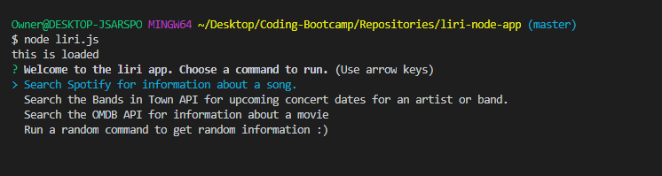
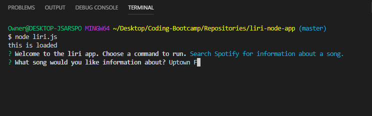
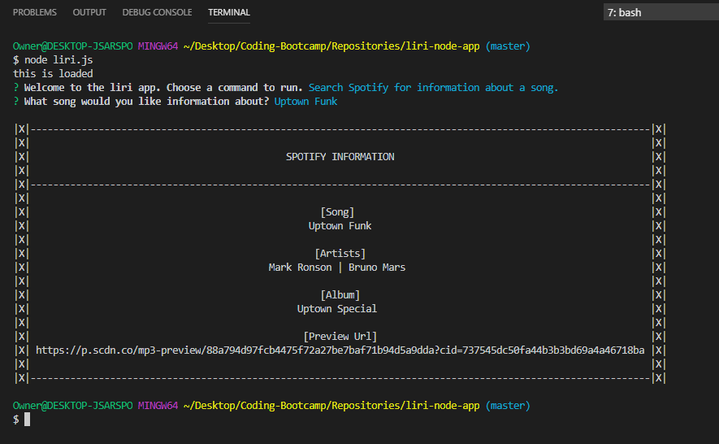
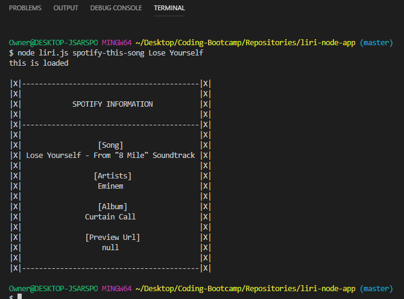
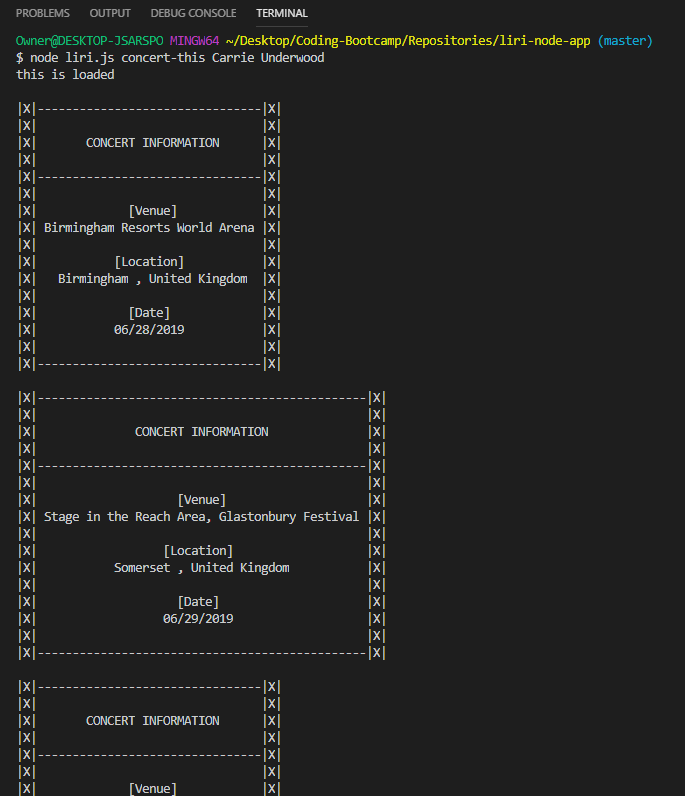
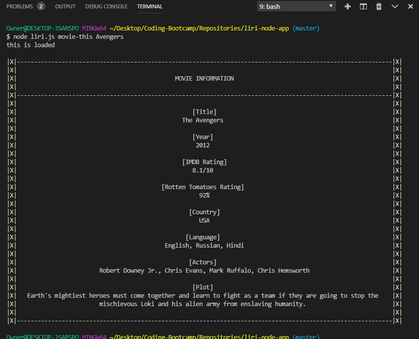
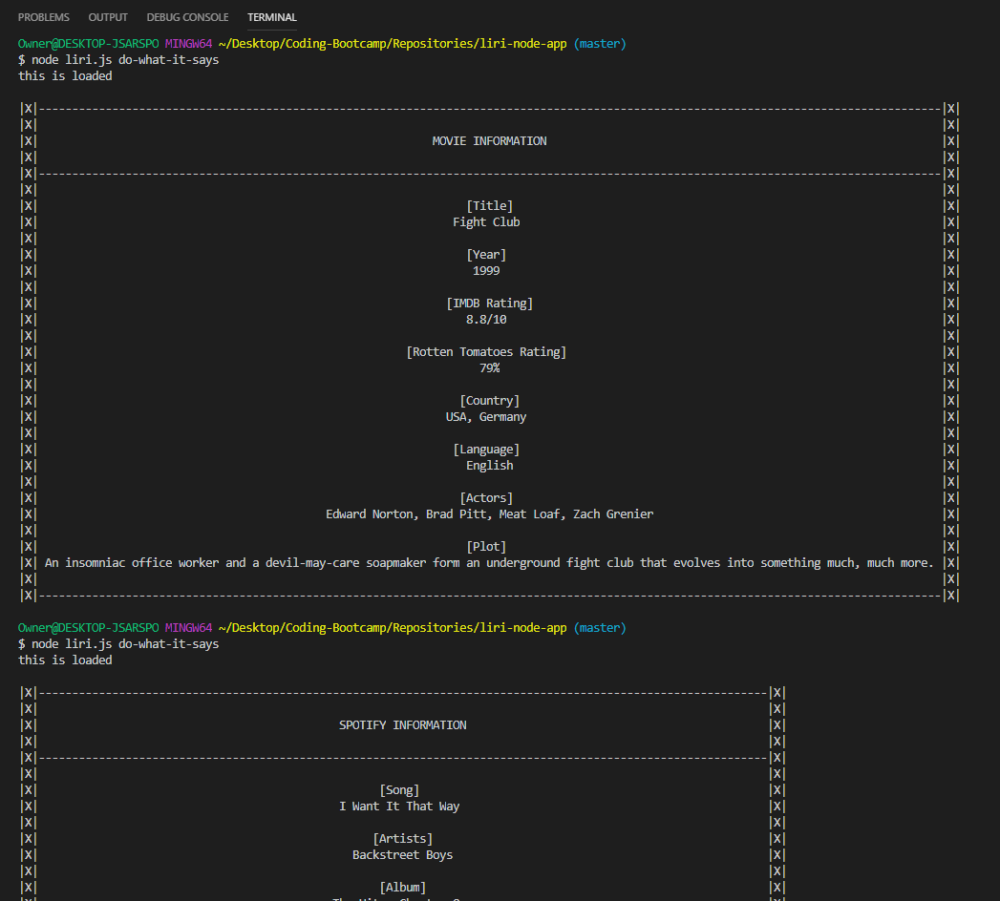
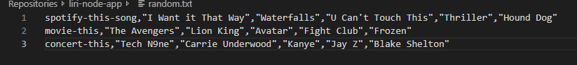

# __liri-node-app__

## __Description__
The liri-node app allows users to retrieve information on songs, movies, and concerts by pulling data from three different APIs. The APIs used in the app are Spotify, Bands in Town, and the OMDB API. The app is ran using Node.js and the commands are entered by passing command-line arguments or by using the inquirer prompt feature.

## __Commands__

### __No Command-Line Input__
If no arguments are given in the command-line, the user is automatically prompted to choose between a few options to help navigate them through the application. 

### __spotify-this-song__ _>Song Title<_
The spotify-this-song command uses the Spotify API to provide some information about a song. 
##### Output
* Song Title
* The Artists
* The Album Title
* Preview Url

### __concert-this__ _>Artist/Band<_
The concert-this command uses axios call to the Bands in Town API to provide a list of upcoming concerts or events for an artist/band. 
##### Output
* Venue
* Location
* Date

### __movie-this__ _>Movie Title<_
The movie-this command uses axios call to the OMDB API to provide information about a movie. 
##### Output
* Title
* Year
* IMDB Rating
* Rotten Tomatoes Rating
* Country
* Language
* Actors
* Plot

### __do-what-it-says__
The do-what-it-says command takes no parameters from the user directly. Instead, it chooses at random one of the other commands to call and passes in a random search parameter pulled from a predefined list in the random.txt file.

